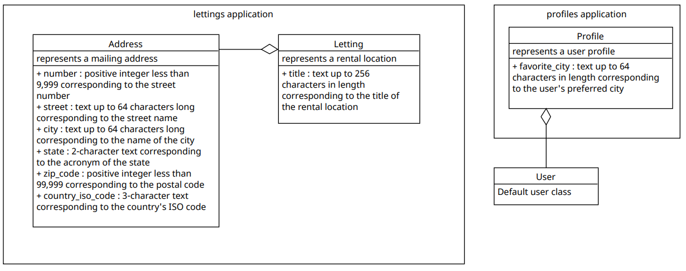

===============
Base de données
===============

Les données sont stockées dans une base de données SQLite3 incluse dans le conteneur du projet Django. Voici quelques étapes pour vérifier que la base de données fonctionne correctement.

- Ouvrir une session shell sqlite3
- connectez-vous à la base de données avec : .open oc-lettings-site.sqlite3
- afficher les tables dans la base de données : .tables
- afficher les colonnes dans la table des profils : pragma table_info(profiles_profile);
- interroger la table de profils : sélectionnez user_id, favorite_city dans profiles_profile où favorite_city comme 'B%' ;
- .quit pour quitter
  
Modèles
-------

Le projet se décompose en 2 applications : locations et profils. Voici la description des modèles et les liens entre les différentes classes.

