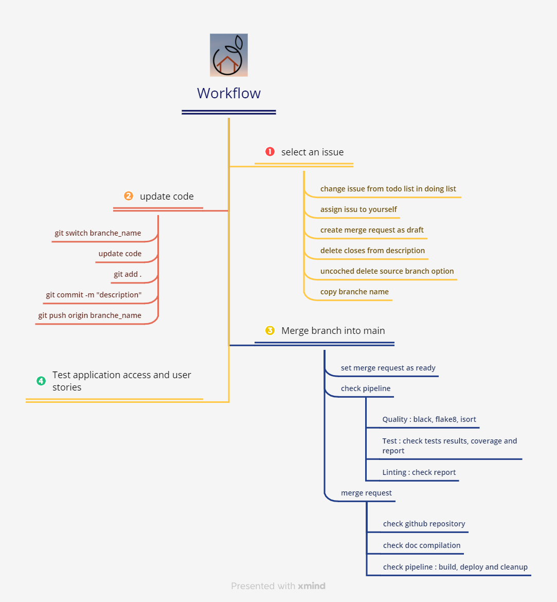

========================
Processus de déploiement
========================

Ce projet est géré par GitHub Actions. 

Description du flux de travail
------------------------------

Le diagramme ci-dessous décrit les étapes de modification et de déploiement d'une modification.

Versionnage
-----------

- lorsqu'une demande de fusion est créée, une branche de développement est générée avec le nom du problème
- ensuite la branche est fusionnée dans la branche principale
- alors la branche principale peut être fusionnée dans une version stable
  
Pipeline
--------

- A l'engagement,
   - les fichiers sont mis à jour dans GitHub Actions et GitHub
   - un premier contrôle de qualité est en cours
   - puis les tests et le linting sont exécutés
   - ensuite le pipeline vérifie si les tests ont une couverture de 80 %
  
- Lors de la demande de fusion dans la branche principale,
   - la dernière version de la documentation est en cours de mise à jour
   - puis la version complète est générée
   - le déploiement s'exécute sur Docker Hub et sur AWS

- Lors d'une demande de fusion dans une branche stable,
   - la version stable de la documentation est en cours de mise à jour
   - le déploiement s'exécute sur Docker Hub et sur AWS