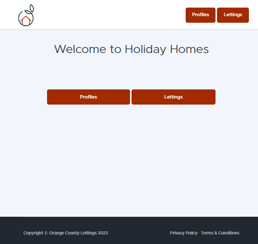
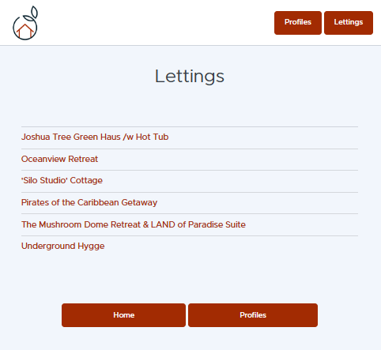
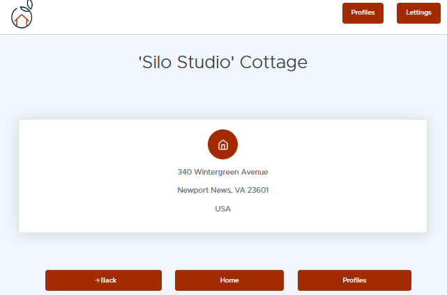
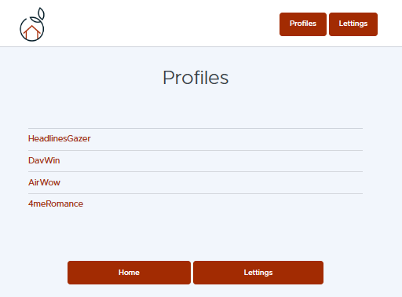

============================
Description de l'application
============================

Orange County Lettings est un site permettant à des utilisateurs 
de mettre leurs biens immobiliers en location. Pour se faire, l'utilisateur 
de l'application possède un profil public auquel ses biens sont rattachés.

Page d'accueil
--------------

Lorsque vous exécutez l'application localement avec la commande python manage.py runserver, vous accédez à http://localhost:8000 pour accéder à la page d'accueil.

-------

Demande de location
-------------------

alors vous pouvez accéder à la liste des locations :

-------

et sélectionnez-en un pour afficher l'adresse :

-------

Demande de profils
------------------

vous pouvez ensuite rentrer chez vous et inspecter la liste des profils :

-------

et regardez les données d'un profil :

